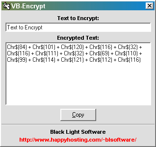



## Simple Visual Basic Anti\-Hex Encryption

### Description

This project shows the user how to compile an select encrypted text and use it within their programs. It makes the program vitually un-hexable.
 
### More Info
 

             |
---                |---
**Submitted On**   |2001-10-08 08:58:30
**By**             |[Ed K\.](https://github.com/Planet-Source-Code/PSCIndex/blob/master/ByAuthor/ed-k.md)
**Level**          |Beginner
**User Rating**    |3.0 (9 globes from 3 users)
**Compatibility**  |VB 5\.0, VB 6\.0
**Category**       |[Encryption](https://github.com/Planet-Source-Code/PSCIndex/blob/master/ByCategory/encryption__1-48.md)
**World**          |[Visual Basic](https://github.com/Planet-Source-Code/PSCIndex/blob/master/ByWorld/visual-basic.md)
**Archive File**   |[Simple Vis2881010132001\.zip](https://github.com/Planet-Source-Code/ed-k-simple-visual-basic-anti-hex-encryption__1-28042/archive/master.zip)

